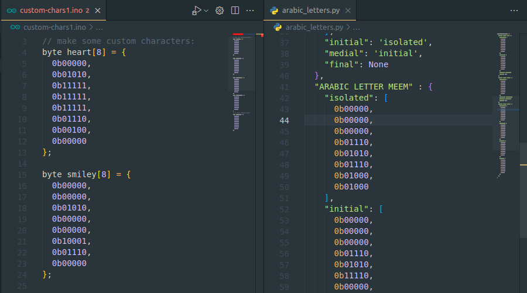
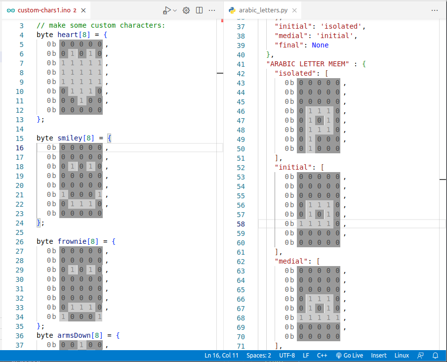

# Binary numbers => Bitsmap

Allow you to see/edit binary numbers in more convenient way: black & white.

## before:

## after:



ver 0.1 (alpha)

## To build installer:

```sh
npm run VSIX
```
if having problem of `vsce not found`, run:
```sh
sudo npm install -g vsce
```

